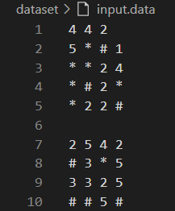

# AEDS: Labirinto Recorrente
  </br>

## Objetivo
Trabalhar com o caminhamento de matrizes de forma aleatória, seguindo o seguinte contexto, tratando-o como um jogo:<br>
* Um garoto se encontra perdido em um labirinto, o qual é compreendido por nós como sendo uma matriz cujas posição de sua localização é dada por um valor x,y dessa estrutura. Nesse labirinto há paredes que bloqueiam certos passos (#), perigos que consomem parte de sua vida (*) e trajetórias (valores positivos que devem ser subtraídos em 1 a cada passagem).
* Quanto as paredes #, não há muito o que fazer a não ser desviar e continuar a rota. Já os perigos, a cada passada, tende a subtrair 1 de vida de um total de 10. Assim, ao ficar sem pontos de vida o algoritmo deve parar e indicar fim de jogo.
* Ao decorrer do jogo, a cada passo correto sob uma estrada, o garoto consome um item, subtraindo esse do valor que compõe a posição x,y. Gravando nessa o valor resultante. A cada subtração bem sucedida é preciso, essa vai para um banco de vida que cheio (a cada 4 ações bem sucedidas) lhe retorna 1 de vida em seu contador. Contudo, pode haver partes do caminho com zero itens, esses devem continuar sendo utilizados, porém, sem computar pontuação.
* A intenção do jogo não é encontrar uma saída, mas sim, tentar consumir o máximo possível de itens até chegar a zerar as possibilidades desse tipo ou morrer tentando.

## Arquivos
* Dataset
  * ```input.data```: contém as matrizes;
  * ```output.data```: contém as matrizes modificadas após o caminhamento.
* Source
  * ```pessoa.hpp```: assinatura da classe que representa o jogador; 
  * ```pessoa.cpp```: implementação da classe que representa o jogador; 
  * ```posicoesAndadas.hpp```: assinatura da classe que representa as posições andadas nas matrizes; 
  * ```posicoesAndadas.cpp```: implementação da classe que representa as posições andadas nas matrizes;
  * ```funcoes.hpp```: assinatura das funções necessárias para o funcionamento do código;
  * ```funcoes.cpp```: implementação das funções necessárias para o funcionamento do código;
  * ```main.cpp```: chamada das funções e criação das variáveis estáticas;
* Compilação
  * ```makefile```: automatiza a compilação dos arquivos.
  
## Variáveis importantes
* Inicializadas em ```main.cpp```:
  * "N" (int): tamanho das matrizes, lido a partir da primeira linha do ```input.data```;
  * "linhaInicio" e "colunaInicio" (int): indicam a posição inicial, digitadas pelo usuário;
  * "nMatrizesArquivo" (int): através de uma função (```int contarLinhasVazias(ifstream arquivo)```), obtém-se o número de matrizes contidas em ```input.data```;
  * "arquivo": objeto associado à ```input.data```;
  * "matriz" (string **): matriz onde o que foi lido de ```input.data``` é salvo;
* Inicializadas em ```pessoa.cpp```:
  * "vida" (int): número de vidas do personagem;
  * "sacola" (int): itens consumidos no caminhamento. Quando é igual a 4, é zerado e uma vida é incrementada;
  * "casasPercorridas" (int): casas percorridas, ao todo; 
  * "valorTotal" (int): valor total de itens consumidos no caminhamento, sem nenhuma alteração;
  * "perigosVisitados" (int): quantas casas contendo ```*``` foram visitadas.
* Inicializadas em ```posicoesAndadas.cpp```:
  * "vetorPosicoesAndadas" (vector<pair<int, int>> *): vetor que contém um vector para cada matriz do arquivo, onde salva-se as coordenadas das posições percorridas em cada uma delas.

## Funções - Manipulação de arquivos e matriz - ```funcoes.cpp```
* ```int lerPrimeiraLinha(ifstream &arquivo)```: lê a primeira linha de ```input.data``` e retorna o tamanho das matrizes;
* ```int contarLinhasVazias(ifstream& arquivo)```: conta as linhas vazias de ```input.data``` e retorna a quantidade de matrizes;
* ```void imprimirMatrizNoArquivo(string ** matriz, ofstream arquivo, int N)```: imprime uma matriz num arquivo;
* ```void criaArquivoEimprimeMatrizNoArquivo(int nMatrizesArquivo, string ** matriz, int& matrizAtual, int N)```: cria um arquivo e imprime uma matriz nele;
* ```void lerMatrizArquivo(string ** matriz, ifstream &arquivo, int N)```: lê uma matriz de ```input.data``` e a salva na "matriz";
* ```void lerMatrizArquivoSeparado(string ** matriz, ifstream &arquivo, int N)```: lê matriz de um arquivo que contém somente uma;
* ```int determinarLinhaInicial()``` e ```int determinarColunaInicial()```: perguntam ao usuário a posição inicial do caminhamento;
* ```void imprimirMatriz(string ** matriz, int N)```: imprime matriz no terminal;
* ```void escreverMatrizArquivo(string ** matriz, ofstream &arquivo, int N)```: escreve uma matriz num arquivo;
* ```void arquivoOutput(ofstream &arquivo, int nMatrizesArquivo, int N)```: escreve em ```output.data``` a matriz modificada após o caminhamento;
* ```void apagarArquivosSeparados(int nMatrizesArquivo)```: ao final da execução, apaga os arquivos que contém somente uma matriz.

## Funções - Caminhamento - ```funcoes.cpp``` 
* ```void andar(Pessoa * p, int linhaInicial, int colunaInicial, int N, int nMatrizesArquivo, PosicoesAndadas * posicoes)```: procedimento principal do caminhamento da matriz, é onde acontece a mudança de posição e troca entre as matrizes;
* ```int sorteioLinha(int linhaAtual, int N)``` e ```int sorteioColuna(int colunaAtual, int N)```: gera, de forma aleatória, o incremento a ser realizado na posição atual;
* ```bool paredeAoRedor(string ** matriz, int linha, int coluna, int N)```: verifica se o jogador está preso entre paredes;
* ```bool posicaoFoiVisitada(PosicoesAndadas * posicoes, int nArquivo, int linha, int coluna)```: verifica se a posição atual da matriz atual já foi visitada;
* ```void posicoesRelatorio(PosicoesAndadas * posicoes, int nMatrizesArquivo, int N)```: imprime quantas posições não foram visitadas e quantas foram visitadas sem repetir, em cada matriz;
* ```int verificarCondicaoTroca(string ** matriz, int N)```: ver qual coluna está habilitada para ser onde muda-se de matriz, ou seja, é possível chegar nessa localização. A coluna está habilitada caso ela não seja composta somente por ```#```.

## Procedimentos iniciais
*Todos acontecem em ```main.cpp``` - Linhas 9 à 40*<br>
A partir de ```input.data```, é possível determinar o número de matrizes e seus tamanhos. Aloca-se a matriz local de acordo com o tamanho obtido através do arquivo e o usuário insere a linha e coluna iniciais, além de instanciar as classes (```posicoesAndadas```) e (```Pessoa```) que contém o vetor de vector que contém as posições visitadas em cada matriz. Depois de obtidas as variáveis iniciais, lê-se do arquivo uma matriz por vez e ela é salva separadamente, ou seja, um arquivo por matriz é criado, visando sobrescrever a matriz alterada após o caminhamento. O nome dos arquivos que contém somente uma matriz é padronizado da seguinte maneira: ```matrizX.data```, sendo ```X``` o número que representa a posição da matriz em ```input.data```. 

## Lógica de caminhamento 
*Descrição do funcionamento da função ```andar```*
* Procedimentos que acontecem enquanto ```Pessoa->vida > 0```:
  * Determinação de qual arquivo que contém somente uma matriz deve ser aberto, usando o contador ```nArquivo```, que indica qual é a matriz atual;
    * Exemplo: Na primeira rodada, ```nArquivo = 1```, então abre-se o arquivo ```matriz1.data```;
  * Adequação da posição inicial: 
    * Caso já tenha acontecido mais de uma rodada, ou seja, houve troca de matriz, se a posição ```matriz[0][0] != "#"```, começo a andar a partir desse lugar. Se não, percorro a matriz até achar uma posição que não seja uma parede;
    * Caso a rodada seja a primeira, se a posição ```matriz[linhaInicial][colunaInicial] != "#"```, começo a andar a partir desse lugar. Se não, percorro a matriz até achar uma posição que não seja uma parede;
    * Exemplo de necessidade de troca da posição inicial:
      * 
  * Antes de andar na matriz atual, verifica-se se o jogador está preso entre paredes. Caso positivo, o jogo acaba;
    * Jogador preso:
      * 
  * Verifica-se qual coluna, a partir da última, está habilitada para ser o critério de troca, ou seja, não é completamente composa por ```#```. O índice de sua posição é salvo em ```int colunaTroca```;
    * Caso em que a coluna é imprópria para ser o critério de troca:
      * 
  * Procedimentos que acontecem enquanto o critério de troca de matriz não é satisfeito, nesse caso, enquanto ```coluna != (colunaTroca)```:
    * Se a posição atual não for ```#``` nem ```*```, ela contém um número. Então subtrai-se 1 dessa posição, e incrementa em 1 a sacola e o valor total. Nesse momento, se a sacola tiver valor 4, ela é zerada e, caso o personagem tenha menos de 10 vidas, ele ganha uma. O valor antigo da vida e da sacola é salvo em ```vidaAnterior``` e ```sacolaAnterior```, ```bool estado```(indicador de alteração no valor da vida) é setado como ```true```;
      * Esses valores (```vidaAnterior```, ```sacolaAnterior``` e ```estado```, são o que determinam se o caminho percorrido é zerado. Quando o personagem passa na posição inicial da primeira matriz, se esses valores permanecem os mesmos, o caminho percorrido não gera mais alterações, então ele foi esgotado. Nesse caso, o jogo é finalizado.
    * Se a posição atual conter ```*```, decrementa-se 1 do valor da vida e incrementa-se em 1 o contador de perigos visitados;
    * Dentro dessas condicionais, verifica se a posição atual já foi visitada. Se não, ela é adicionada ao vetor de posições andadas, visando contá-las;
    * Incrementa-se em 1 o contador de casas percorridas no total;
    * Sorteio do incremento da linha e da coluna, gerando a próxima posição;
      * Possíveis resultados de cada sorteio: -1, 0, 1, um desses valores é incrementado à linha/coluna atual;
      * Caso ela seja ```#```, o incremento à linha e à coluna não é feito e o sorteio acontece de novo;
    * Se após a rodada a vida for zerada, o jogo acaba;
  * Incrementa-se 1 em ```nArquivo``` para a troca de matriz. Caso o novo valor for maior que o número total de matrizes, ```nArquivo``` volta a ser 1, ou seja, o jogo volta para a primeira matriz;
  * Incrementa-se 1 no contador de rodadas.

## Função ```posicoesRelatorio``` 
* A quantidade de posições não visitadas em cada matriz é determinada com a subtração da quantidade total de posições da matriz pela quantidade de posições visitadas (tamanho do vector de posições andadas referente àquela matriz);
* Quantidade de posições visitadas sem repetir, no total: soma dos tamanhos das quantidades de posições visitadas de cada matriz.
  
## Impressões finais no terminal
* As casas percorridas ao todo, soma de itens consumidos e perigos enfrentados no total são acessadas através dos atributos da classe ```Pessoa```;
* Resultados da função ```posicoesRelatorio```;
* Tempo de execução, em milissegundos.
  
## Resultados 
* Exemplo de um ```input.data``` como entrada e como ficam ```output.data``` e o terminal.
  * ```input.data```:
    * 
  * ```output.data```:
    * 
  * Terminal:
    * 
Com esses resultados é possível realizar a interpretação do caminhamento. No caso das imagens acima, por exemplo, é possível afirmar que o personagem perdeu todas as suas vidas antes de passar para a segunda matriz, pois esta permanece inalterada em ```output.data```.

## Conclusão
A partir do que foi mostrado acima, conclui-se que o objetivo de caminhar aleatoriamente por matrizes foi atendido e que o personagem atende à todas as regras de caminhamento requisitadas. Porém, não é possível analisar o custo computacional dessa forma de caminhamento, a não ser pela medida do tempo de execução. O custo de um algoritmo aleatório não depende mais somente do tamanho da entrada, mas sim das decisões tomadas por ele, que podem ser diferentes em cada execução. Em trabalhos futuros, o custo computacional poderá ser analisado caso o personagem percorresse um caminho pré-determinado pelo código ou por um conjunto de regras.

## Considerações finais
* Após as manipulações, a memória da matriz é liberada, o arquivo é fechado e os arquivos contendo uma matriz são excluídos.
* Especificações da máquina em que o código foi rodado:
  * Processador Intel Core i5, 7th Gen;
  * Sistema Operacional Windows 10;
  * Terminal do WSL: Ubuntu 20.04.5;
  * 8GB de RAM.
* | Comando                |  Função                                                                                           |                     
  | -----------------------| ------------------------------------------------------------------------------------------------- |
  |  `make clean`          | Apaga a última compilação realizada contida na pasta build                                        |
  |  `make`                | Executa a compilação do programa utilizando o gcc, e o resultado vai para a pasta build           |
  |  `make run`            | Executa o programa da pasta build após a realização da compilação                                 |
